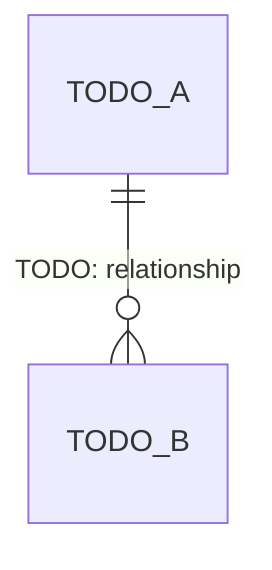
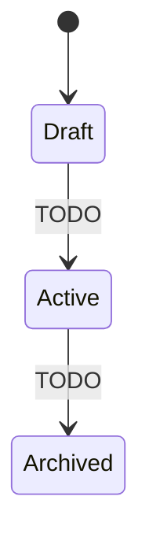

# Domain model

The conceptual model of Evan Harmon Website — the core concepts, how they relate,
their lifecycles, and the business rules that govern them. This is the shared
**ubiquitous language**: name things here the same way they are named in code,
specs, and conversation.

## Concepts

The core entities/nouns and what each means.

| Concept | Definition |
|---|---|
| TODO | TODO |

## Relationships

How the concepts relate — ownership, cardinality, dependencies.

## Lifecycles

The states a key entity moves through, and what triggers each transition.

## Business rules & invariants

The rules that must always hold — constraints, validations, policies. These are
what specs and their acceptance criteria enforce (see
[../../specs/](../../specs/)).

- TODO: rule or invariant (e.g. "a TODO_A always has at least one TODO_B").
